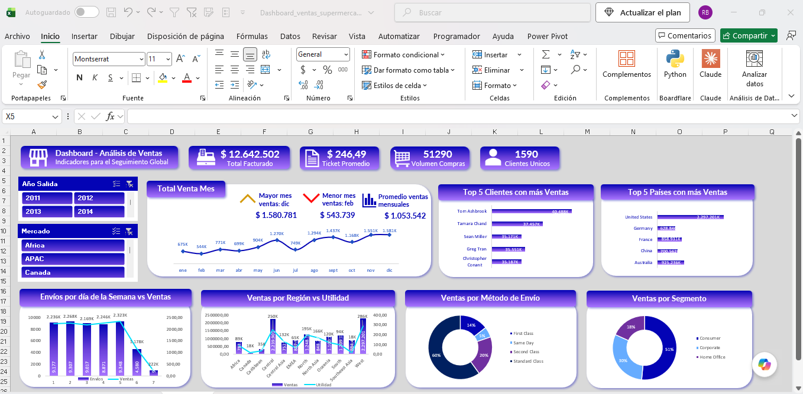

# 📊 Dashboard de Ventas - Supermercado

Dashboard desarrollado en Excel para analizar el desempeño comercial de una empresa de ventas con cobertura internacional, integrando indicadores de facturación, clientes, regiones y canales de envío.



---

## 🚀 Resumen Ejecutivo

| KPI | Valor |
|---|---|
| 💰 Facturación total | **$12,642,502** |
| 🎫 Ticket promedio | **$246.49** |
| 📦 Volumen de compras | **51,290 pedidos** |
| 👥 Clientes únicos | **1,590** |
| 📈 Utilidad total | **$1,467,457** (margen **11.6%**) |
| 🚚 Promedio de días de entrega | **3.97 días** |
| 🌍 Países con ventas | **147** |

---

## 🔍 Hallazgos Clave

### 1. Concentración en pocos mercados
El **Top 5 de países** concentra el **42.8%** de la facturación, y solo **Estados Unidos representa el 18.2%** del total ($2.30M). Le siguen Australia ($925K), Francia ($859K), China ($701K) y Alemania ($629K).

### 2. Estacionalidad marcada en el cierre de año
Las ventas crecen progresivamente desde **septiembre**, alcanzando el pico en **diciembre ($1.58M)** y noviembre ($1.55M). El mes más bajo es **febrero ($544K)** — diciembre vende **+190%** que febrero. El segundo semestre factura **60% más** que el primero.

### 3. El segmento Consumer domina
**Consumer** genera el **51.5%** de las ventas, seguido de Corporate (30.3%) y Home Office (18.3%). Es un negocio con fuerte componente de consumo masivo.

### 4. Envío estándar como canal principal
**Standard Class** concentra el **59.9%** de las ventas; el resto se reparte entre Second Class (20.3%), First Class (14.5%) y Same Day (5.3%).

### 5. Categoría tecnología lidera
Las subcategorías **Phones ($1.71M), Copiers ($1.51M), Chairs ($1.50M), Bookcases ($1.47M) y Storage ($1.13M)** suman el **57.8%** de la facturación total.

### 6. Baja concentración por cliente
El Top 5 de clientes (Tom Ashbrook, Tamara Chand, Greg Tran, Christopher Conant y Sean Miller) suma solo **$184K (~1.5%** del total), lo que indica una base de clientes diversificada y bajo riesgo de dependencia.

---

## 🏗️ Estructura del Proyecto

```
dashboard_ventas_supermercado/
├── dashboard_ventas_supermercado.xlsx   # Libro de Excel (datos + análisis + dashboard)
├── image_dashboard_ventas.png           # Captura del dashboard
└── README.md                            # Documentación del proyecto
```

### Estructura del libro de Excel

| Hoja | Contenido |
|---|---|
| **Ventas Supermercado** | Base de datos cruda: 51,290 pedidos × 36 columnas (ventas, cliente, país, segmento, envío, fechas, etc.) |
| **Análisis** | Tablas dinámicas y KPIs: ventas por mes, región, segmento, método de envío, top clientes y países |
| **Dashboard** | Visualización interactiva con los indicadores del negocio |

---

## 💡 Una reflexión sobre Excel y el análisis de datos

Lo interesante no es solamente la visualización, sino la capacidad de convertir datos operativos en información que ayude a responder preguntas de negocio, y aquí es donde Excel sigue siendo especialmente relevante para las pequeñas y medianas empresas.

Una PyME no siempre necesita comenzar con una arquitectura compleja de datos, muchas veces necesita algo más concreto:

```
datos ordenados → métricas confiables → visualización clara → decisiones
```

Excel permite construir ese camino con una barrera de entrada relativamente baja, aprovechando herramientas como **tablas dinámicas**, **Power Query**, **fórmulas**, **segmentadores** y **visualizaciones interactivas**.

Esto no significa que Excel sea la solución para todo: a medida que aumentan el volumen, la complejidad y las necesidades de automatización, herramientas como **SQL**, **Power BI**, **Python** o **plataformas cloud** adquieren mayor protagonismo. La herramienta es solo una parte de la ecuación.

El verdadero valor está en saber **qué analizar**, **qué KPI construir** y **qué decisión puede tomarse** a partir de los datos.

Por eso, para mí, Excel sigue teniendo un lugar importante dentro del ecosistema de Data Analytics, especialmente en organizaciones que necesitan comenzar a profesionalizar el uso de sus datos sin realizar grandes inversiones iniciales.

---

## 📌 Aplicabilidad Empresarial

Este tipo de análisis es útil para:

- **Gerencia General y Dirección Financiera** — monitoreo de facturación, márgenes y estacionalidad
- **Equipos de Estrategia y Planificación** — detección de mercados y temporadas de mayor demanda
- **Analistas de Business Intelligence** — construcción de KPIs y modelos de reporte
- **Product Managers de líneas de negocio** — identificación de categorías y segmentos más rentables
- **Equipos Comerciales con cobertura internacional** — priorización de países y regiones

---

## 👤 Autor

**Ruben Barrios**

Proyecto práctico desarrollado como parte de portafolio profesional en análisis de datos y Business Intelligence.

Fuente de los datos: **Academia Datdata**.

⭐ Si este proyecto te parece interesante, no olvides darle una estrella al repositorio y conectar en [LinkedIn](https://www.linkedin.com/in/ruben-barrios-1430712ab/).

`#DataAnalytics` `#PowerBI` `#BusinessIntelligence` `#FinancialAnalysis` `#DAX` `#DataPortfolio` `#ConsumerTech` `#Datdata`
